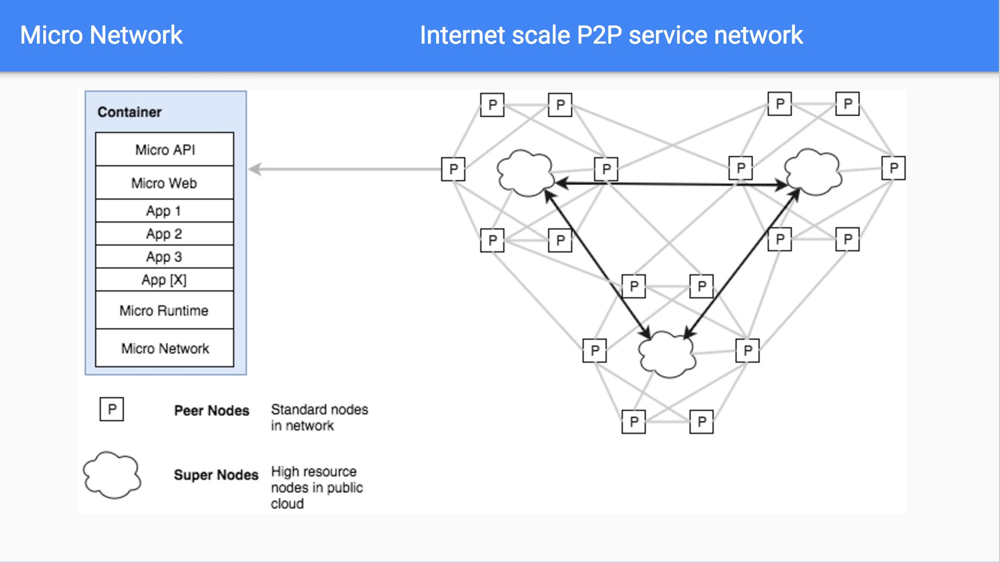
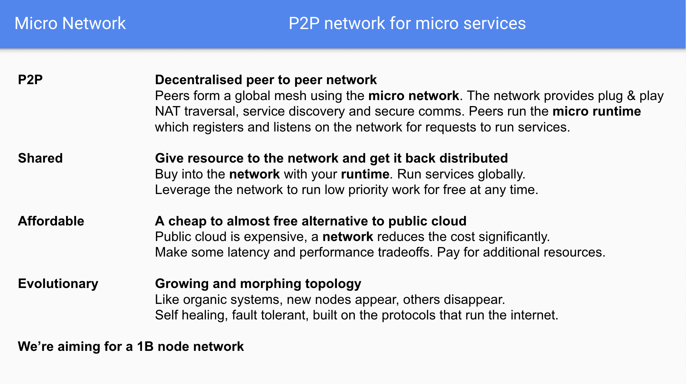
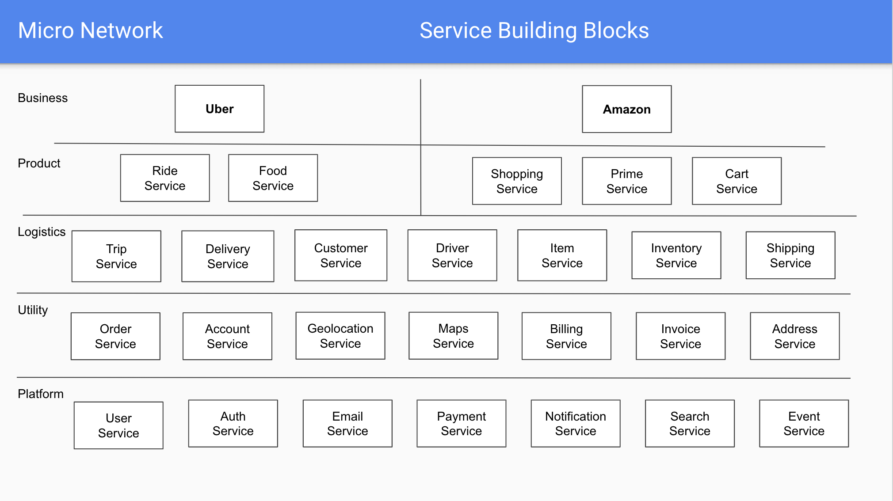

An open protocol for Micro services

## Overview

The power of collaborative development has largely been restricted to trusted environments within organisations.
These platforms unlock incredible productivity and compounding value with every new service added. They provide
an always-on runtime and known developer workflow for engineers to collaborate on. This has been difficult 
to achieve outside of organisations.

The Micro network solves this problem by creating a global shared services network.
Micro will enable users to run their own nodes that offer services to anyone else they 
peer with. Each node will act as a gateway to the entire network, allowing the owner to benefit 
financially from it's use.

## Motivation

The world is moving towards being driven entirely by technology. Part of that move involves shifting our experiences to digital rather than 
physical services. In a world where everything is a service, we imagine there needs to be a system for interaction and model of development for 
these services. What's more, there's an opportunity to provide an economic incentive to every human being to participate and benefit from 
such a network.

In our current world, the few dominate the many. The term FANG, has come to reference the global tech incumbents that rule our lives, our 
digital footprint and more. They benefit financially from all our actions and deliver addictive systems that are impossible to break 
free of. We have a chance to build a system in which these behaviours are removed, where the morals and ethics are coded into systems which 
are openly and transparently available for all to see and use.

## Mission

The micro network's purpose is to create a truly open and free network for services that anyone can participate in and benefit from without 
intermediaries, without abuse or exploitation, and without the purview of the current powers that be.

As part of this endeavour, we are aware that the network will create significant amounts of financial liquidity for a number of people, including 
those running services. Yet, there is another demographic of people who will not be so privileged, who will have no access and will not be 
capable of participating directly. To those, we want to ensure they are maximally benefitting from this effort also. 

2.5% of all profit flowing through the network will be donated to the least privileged by way of charitable donation.

No system of any kind that can benefit mankind should be built without taking into consideration the least privileged of all, those without 
access to even begin participating. We will ensure that whatever is built is not just benefiting the 1% but actually making a difference 
through conscious effort.

## Operations

The network's ultimate goal is to be self governing, but the resources and people it takes to get to that place costs money. So 2.5% of all 
profit will also go towards the network operations and ensuring it's continued success for the foreseeable future. This will include a 
number of software engineers to maintain the code base, platform engineers to ensure the core backbone is running and some level of 
financial and operational management. All will be governed through traditional legal entities until it makes sense not to do so.

## Execution

The network will start by implementing a working prototype of a gateway that can interconnect multiple Micro deployments across the globe 
using the MUCP protocol. We'll then move onto the transactional layer for economic incentive and value exchange. This will likely reuse 
existing cryptocurrency protocols rather than attempting to implement one from scratch. Once this is established, we'll start to invite 
users to test the network before moving on to reputation based scoring and the client side interface for external consumption.

Bootstrapping should take 18-24 months with a need to fund the project to get off the ground.

## Funding

Having tried many forms of funding in the past, it's clear we need complete alignment from those involved and so finding the right 
participants from the get go is incredibly important. There must be total clarity on the motivations of those joining and how they 
stand to benefit. The efforts of the project cannot be overshadowed by those seeking power law distributions.

## Architecture

The network is globally distributed by design and based on existing open source technologies developed by Micro and others.
It provides the core requirements for collaborative service development at scale. This includes a common
communication protocol, service discovery system, secure governance, service runtime and resource exchange model.

### High Level

At the high level we're using the open source [Micro](https://github.com/micro/micro) platform as the foundation for API 
first development and a runtime for Micro services. Each user runs a local server which provides access to the network, 
a runtime for running services, a local api gateway and web browser.



In future this design will include automatic data synchronization and backup for long term storage.

### Features

The network features a p2p compute runtime with a high bandwidth backbone. The network itself provides discovery, governance and a runtime.
The design is such that whatever resource you put in, you get back distributed across the network. It's global and shared by default. You can
buy more resource using tokens but you'll also get tokens for any requests made to your services.



The network is evolutionary and our goal is to reach 1B nodes with over 10x more services running on the network itself.

### Services

The network provides a Micro service runtime. Each service can be used as a building block for the next.
This layering allows the creation of unique services on a foundation of hundreds of others. This is the microservice
architecture pattern used by Google, Netflix, Uber and others which we're bringing to the masses.



Developers contribute services to the network and build on each others work. Services are open source by default 
and those built by Micro reside in the shared monorepo [micro/services](https://github.com/micro/services), where 
anyone can contribute via a pull request.

### Identity

Most networks being bootstrapped require some form of identity system. Many of these start with base level asymmetric cryptography
using public/private key pairs. While we'll look to use these we believe this system is not enough. Anyone can participate in the
network and anyone can generate a public/private key pair. Bad actors will likely cycle these and DDOS the network.

What we propose is a two layer identity system, with layer 1 as the public/private key pair (potentially using SPIFFE) and layer 2
as a reputation based scoring system which over time solidifies your reputation and trusted identity in the network. The longer
you exist in the network and participate the more likely it is we can identify you as a trusted party. New participants will be
provided some base level access but must either pay to participate or stay on the network long enough to get further access.

The identity system will likely be as follows

- Layer 0 - the node connected to the network
- Layer 1 - the app providing a service to the network
- Layer 2 - the reputation scoring based on node + service

### Ownership

Service ownership in a trustless environment is of utmost concern. Identifying not just by above mentioned systems but by also 
using a crypto native method that is already in place. Each service will be prescribed an NFT that codifies it's digital 
ownership on the blockchain. This ensures we can always track service owners and beneficiaries of those services. This also 
means ownership is transferrable, so while node operators may initially run these services, others can then own and benefit 
financially from them in the long run.

### Evolution

No system in nature is static and so we should not expect any technical infrastructure or software to remain static. We believe
evolutionary software is far superior to anything else and this in principle needs to be promoted by the underlying runtime
on which it runs. The micro network will be an evolutionary system which requires all services run on it to also behave in such
a manner.

Software will be downloaded from its public source form. It will then be built and run, all within the same location. Updates to
the source will result in periodic generation of new versions of a running service. Previous instantiations will remain for
their lifetime or until they die for any unexpected reason. This is evolution and we believe evolution is the most powerful
method for software delivery.

### Runtime

While our primary focus is to provide a globally distributed network for Micro services this can't be fully realised without a
method of deploying software. It's important that in the context of creating evolutionary systems we provide a runtime which
supports this method of development. The micro runtime is a process management system tightly coupled to the network itself
with the ability to run applications from source code.

Developers no longer need be concerned with packaging and shipping their code. If it exists in a public repository it can be
deployed to the micro network. We will primarily look to support Git via GitHub as the source of truth. This allows anyone
to run a copy of whatever already exists in the network but it also creates a level of trust around completely **Open Source Services**.

Beyond this, our expectation is to standardise on wasm (web assembly) which lets us provide a universal runtime for any
language which supports wasm compilation. We'll likely provide rudimentary language detection early on to auto-compile wasm
binaries. Eliminating another intermediate step for developers to ship software.

### Governance

While we can provide an evolutionary network and a runtime which supports such a system, it is very unlikely that such a system
can be sustained standalone. Platforms are managed by operators and every system in nature has some form of governance. The
micro network will be no different.

Having learned from years of managing platforms it is abundantly clear that we do not want human involvement to manage something
on the order of 1B nodes. With likely 10x more services. Even if the task of management is distributed to node owners (which
defeats the purpose of our goals) it would be impossible to perform such coordination at scale. Because of this the system
we develop will have to be self governing.

The Micro network will include self governance driven through automation. No humans will be involved in commanding the placement
of services or have the ability to shut them down. The governance mechanism for all services and the network itself will be in code,
it will be a service running on the network itself. It will also be an open source service anyone can see the code for and
contribute to.

Like any other service, this system will be evolutionary.

### Network

In the case of Micro, the "network" is an overloaded term both referring to the underlying system made up of nodes or peers which
provide compute and also the overlaying communication system used for services to discover and communicate with each other.

In this case we'll speak to the service layer network. The micro network provided to developers consists of four pieces;
registry, transport, broker and client/server. These components can be found in [Micro](https://github.com/micro/micro)
for more info.

The registry provides a service discovery mechanism for applications in the network. Think of this as DNS but in a way that's
self describing and built for transient systems. Our assumption is that developers should not have to leave the network
to understand what a service is built for and that any number of prototypes with high percentage failure rates will exist on the
network itself. Because of this we need a system that describes services in their entirety and expiration of dead nodes to
prevent various failure modes.

The transport provides a common synchronous communication system. Ideally this is abstracted away so the developer does not
have to worry about what the protocol is. In our mind most frameworks and libraries provide rich http support with prominent
ecosystems. We want to enable this while providing a highly efficient binary protocol beneath the covers.

The broker is an asynchronous communication system. It allows for publishing messages to an unknown number of interested parties.
In some cases there may be no subscribers in which case we need to account for future interest and potential short term storage
and access. It is critical that event based programming be a core tenant of the network. This likely also promotes a functional
programming model which will be native to the network.

The client/server abstracts away the registry, transport and broker so that from a development standpoint all that remains is a
focus on the domain itself. Ideally inter-service communication should be thought more as high level domain driven design and
later on flow based programming.

The network encapsulates low level details of distributed system communication and allows the developer to focus on whats important.

## Protocol

The network is based on MUCP (micro communication protocol).

### Overview

The protocol is a very simple transport agnostic set of headers and an encoded message body. The protocol supports request/response, 
bidirectional streaming and asynchronous message broadcasting. Where the transport or broker accepts headers (such as http) the message headers 
will be encoded in the transport headers. Otherwise the entire header and message will be encoded in an envelope. Our preference is to use protobuf 
but the protocol should scan for a starting json delimiter `{` to know whether to decode to json.

The protocol covers 3 forms of communication: 

- [Call](#call) - Sending a request and synchronously receiving a response
- [Stream](#stream) - Maintaining an open connection over which messages are passed back and forth
- [Publish](#publish) - Asynchronously broadcast events to topics with multiple interested parties

### Call

Request/Response communication allows a single request to be sent and a response to be received. The request and response 
are of identical format to correlate one to one mapping. A request should be passed with a unique id, name of the service, 
the endpoint being called and the content-type. 

An example request.

```
{
	Header: {
		"Micro-Id": "d02d5da0-14dc-11e9-ab14-d663bd873d93",
		"Micro-Service": "greeter",
		"Micro-Endpoint": "Say.Hello",
		"Content-Type": "application/protobuf",
	}
	Body: []byte(...)
}
```

In the event of an error we return it as a header. This may also be returned in the body.

```
{
	Header: {
		"Micro-Id": "d02d5da0-14dc-11e9-ab14-d663bd873d93",
		"Micro-Service": "greeter",
		"Micro-Endpoint": "Say.Hello",
		"Micro-Error": {"id":"greeter.Say.Hello","code":500,"detail":"Failed greeting","status":"Internal Server Error"},
	}
}
```

### Stream

A stream is a long live connection over which messages are passed back and forth. This could be request response or streaming updates 
such as gps location from a client to the server. A stream uses identical request/response semantics except it also includes a 
stream id.

```
{
        Header: {
                "Micro-Id": "d02d5da0-14dc-11e9-ab14-d663bd873d93",
		"Micro-Stream": "user.1"
                "Micro-Service": "geolocation",
                "Micro-Endpoint": "Gps.Update",
                "Content-Type": "application/protobuf",
        }
        Body: []byte(...)
}
```

### Publish

Messages can be broadcast asynchronously to a topic. This requires no knowledge of subscribers or interested parties a head of time. 
It provides a method for notification of events without requiring a response. In the event no subscribers exist, the messages 
can be saved in an inbox until subscribers are present to retrieve the messages at a later time.

An example broadcast message.

```
{
	Header: {
		"Micro-Id": "d02d5da0-14dc-11e9-ab14-d663bd873d93",
		"Micro-Topic": "events",
		"Content-Type": "application/protobuf",
	}
	Body: []byte(...)
}
```

In the event you want to subscribe to a topic you must specify a queue.

```
{
        Header: {
                "Micro-Id": "d02d5da0-14dc-11e9-ab14-d663bd873d93",
                "Micro-Topic": "events",
                "Micro-Queue": "customer",
        }
}
```


## Collaboration

It is not enough to provide an environment for running applications. Many platforms already exist for this function. Individuals
can use cloud hosting to do this. Networks are being built to run decentralized applications (dApps). This is all good and well
but at the base level is just compute, access to resource.

What's more useful is a focus on **collaboration**. Organizations create a single cloud hosting account as a trusted environment
for their engineers and teams to build software together which then becomes a unified product offering. They do not have to worry
about whether or not they can trust other teams or engineers using it. They do not have to worry about services disappearing or
even building everything from the ground up. Teams working independently produce services which can be accessed by others teams. This
becomes the basis for new applications, the foundation which they no longer have to rebuild. The velocity of their development
increases with every new service added. New products can be built at rapid pace, and the compounding value of this in the long
term has been demonstrated by Amazon, Facebook, Google, Uber, and many more.

Collaboration is the key. This must be our focus and is our focus. Because we focus on microservice development. We provide
the building blocks in a network and push forward the idea of collaborative software development so that we as individuals
can collectively build towards what does not exist outside of organizations. This is an opportunity to build something at
the scale of Google and others in a coordinated effort without any central intermediary or the need to work at a company.

Collaboration will be our central focus, not compute, not storage, nor singular applications, but instead multi application
services built collectively by the network.

## Value Exchange

What do we mean by value exchange? It is not enough to provide an environment for collaborative development. We need some way of
rewarding those who are participants in the network and provide resources or services to the network itself.

Value exchange is basically the idea of exchanging some *thing* in return for some *value*. In our case we will exchange **resources**
for the use of the network **runtime** or **services**. Resources can either be compute offered to the network via the runtime,
the ability to actually run services, or some form of monetary payment. Resources will be given a quantified value in the network
and abstracted away into a native exchange method using an api **token**.

Api tokens will behave as a utility token, they will have a lifetime and it will be possible to generate them if a user participates
in the network or makes monetary payment to acquire them. It will be possible to refresh expired tokens.

Our expectation is that the token becomes the native exchange method for resource in the micro network but the value of a token
will be self adjusting based on the size of the network. The value of the network is based on the number of participants, resources
and services, not the token itself.

## Economics

Building such an architecture is good in theory but in practice requires network effects to drive its use, growth and ability to thrive.
It is not enough to create an open network and ask developers to run peers in the network or contribute, there has to be some economic
incentive to be part of it.

This is where [Token Economics](https://en.wikipedia.org/wiki/Token_economy) plays a role. Those contributing resources to the scale
of the network and/or services on the network should be rewarded accordingly. Our goal is to build a native tokenized transaction
system into the network to provide this resource usage model via exchange of tokens for services.

Here's a good explanation of [Token Economics](https://www.investinblockchain.com/token-economics/).

## Interface

The Micro development model has been proven out over a number of years using the [Go](https://go.dev) based programming language and 
supplementary client libraries which enable broad access to developers but mass appeal and consumption of services without programming will 
require an entirely new approach.

We propose the development of a client interface to compliment the development model which focuses on the end consumer. Where developers 
and operators will focus on the infrastructure and programming, the client interface will enable anyone to access services via web or mobile. 
Ideally using existing well known constructs like forms and messaging.

A focus on delivering an end consumer facing experience keeps us from endlessly building software. 
Ultimately the value of the network is in it's consumption, not just by developers, but by everyone.

## Potential

At a given point we do not want to program but instead have our needs anticipated by a higher level system.

For decades we rebuild the same systems and services over and over. We amass a wealth of technology advancements only to 
tear them down or leave them to be governed by large siloed corporate entities. When the network exists 
and we have surfaced 1000+ base motor functions as services, when we have created a language to stitch 
these together as easily as the english language, and when we have the inputs from requests, images, audio, video, sensors 
then we can begin work on a system that can harness this capability as a general AI. 

Intelligence is an emergent behaviour in the universe and the creation of such a thing is no different. Base motor 
functions begin as the ability to move and react, to influence the world around even without the knowledge of what 
that means. Intelligence is something that must be given raw sensory input and the nervous system to process 
them. A brain is nothing more than a massive event processing system with state and pattern recognition.

A singularity is not something you can just create, it's something that must emerge, but if you understand 
the properties required to nurture such a system into existence then there is the possibility of producing it.

Google and others are attempting to move beyond vertical based deep learning to a more general approach. [Jeff Dean](https://en.wikipedia.org/wiki/Jeff_Dean_(computer_scientist))
has spent his career building the systems that have shaped Google from the foundation up. This did not start with 
general AI but instead raw data processing at scale. GFS, BigTable, Borg, MapReduce, Search, Ads. All these 
led to Google Brain and what came after related to TensorFlow.

We have the opportunity, not today, but in a decade from now to build the next intelligent system based 
on an emergent approach. We cannot compete with Google head on based on resources (both in compute and cash) but 
if we crowdsource this effort using a network, if we crowdsource the compute, the services, then 
we have the chance of building a completely open general AI not governed by corporate incumbents.

## Summary

The Micro network is an open global services network that enables anyone to participate in the exchange and use of digital services. It's 
an entirely open source and free service to operate. Participation in which will result in creation of a new services economy directly 
benefiting the owners and operators of the nodes on the network. End users will be able to leverage all of these services in a familiar 
and easy to use messaging or voice based interface. 

Micro has the potential to break us free of existing centralised technological platforms and enable the creation of a new entirely open 
network that anyone can benefit from and be part of. It will leverage as much existing open source and web3 technology as possible to 
build on the foundations of what has already been started.

## Updates

If you're interested in learning more reach out or follow us on [Twitter](https://twitter.com/mudotxyz).

## Glossary of Terms

- **Network** - is the entire system for communication and coordination
- **Gateway** - the interconnect between peer nodes on the network
- **Backbone** - is the core public high bandwidth for the network itself
- **Super Node** - is a host which runs the *backbone* of the network
- **Peer Node** - is a host which runs *services* in the network
- **Service** - is a process which runs in the network and provides some utility
- **Token** - is an economic incentive used in exchange for the use of a service
- **Server** - is the Micro server which runs the services locally or in the cloud

---

*Author: Asim Aslam*

*Last Updated: April 25th 2022*
